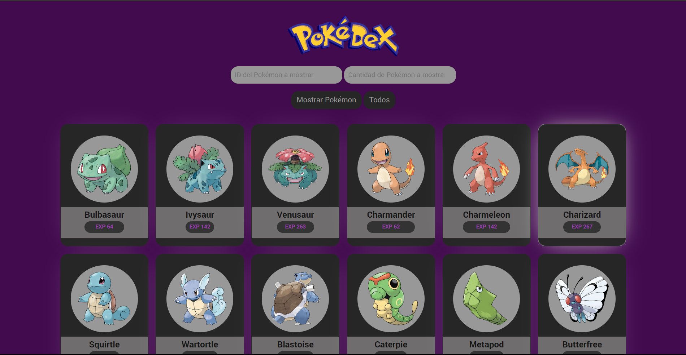

# Pokédex

Esta es una aplicación web que te permite explorar y personalizar la información de Pokémon utilizando la API de PokeAPI. Aquí encontrarás información sobre cómo usar la aplicación y cómo interactuar con ella.

## Características Principales

- **Cargar Pokémon por Defecto**: Al cargar la página, se muestran automáticamente una cantidad n de pokemon definida por defecto en la función:

      cargarPokemonPorDefecto = async () => {
      const limit = 300;

Para hacerlo, simplemente espera a que la página se cargue o haz clic en el botón "Todos".

- **Buscar Pokémon**: Puedes buscar un Pokémon específico proporcionando su ID en el campo "ID del Pokémon a mostrar" y la cantidad de Pokémon que deseas ver en el campo "Cantidad de Pokémon a mostrar". Para su correcto funcionamiento, es necesario llenar ambos campos. La cantidad de Pokémon que se mostrarán será la cantidad de Pokémon que siguen después del Pokémon con el ID ingresado. Luego, haz clic en "Mostrar Pokémon" para ver los resultados.

- **Mostrar Pokémon**: Cuando haces clic en el botón "Mostrar Pokémon" después de ingresar un ID y una cantidad, se realiza una solicitud a la API de PokeAPI para obtener los Pokémon correspondientes. Estos Pokémon se muestran en la sección de resultados.

- **Personalizar Pokémon**: Haciendo clic en cualquier Pokémon mostrado, puedes personalizar sus estadísticas. Se abrirá un cuadro de diálogo con los detalles del Pokémon, incluyendo su imagen, nombre, tipos y estadísticas. Puedes editar las estadísticas arrastrando los controles deslizantes y, luego, guardar los cambios haciendo clic en "Guardar Edición". Los Pokémon personalizados se almacenan en una API mock llamada "mockAPI".

## Configuración

Sigue estos pasos para configurar la Pokédex Pokémon en tu entorno local:

1. Clona el repositorio desde GitHub:
  
      git clone https://github.com/RCNicolas/Pokedex.git
  
2. Navega al directorio del proyecto:
  
      cd pokedex-pokemon
  
3. Abre el archivo `index.html` en tu navegador web.
  
## Uso

Para buscar Pokémon utilizando los campos de entrada (ID y cantidad), sigue estos pasos:

1. Ingresa el ID del Pokémon que deseas como punto de partida. Por ejemplo, si ingresaste "5", se mostrarán Pokémon a partir del quinto Pokémon en la lista de PokeAPI.

2. Ingresa la cantidad de Pokémon que deseas ver después del Pokémon con el ID especificado. Por ejemplo, si ingresaste "10", se mostrarán los próximos 10 Pokémon después del quinto Pokémon en la lista.

3. Haz clic en "Mostrar Pokémon" para ver los resultados.

Ten en cuenta que es necesario llenar ambos campos para que la búsqueda funcione correctamente. Si no se ingresa un valor en alguno de los campos, la búsqueda no se realizará y se mantendrán los Pokémon cargados previamente en la pantalla.

### Mostrar Pokémon

1. En la sección "ID del Pokémon a mostrar", ingresa el ID del Pokémon que deseas ver.
2. En la sección "Cantidad de Pokémon a mostrar", ingresa el número de Pokémon que deseas mostrar.
3. Haz clic en el botón "Mostrar Pokémon" para mostrar los Pokémon seleccionados o usa "Todos" para cargar todos los Pokémon disponibles.
4. Ten en cuenta que la cantidad de pokemon se mostrara en base al ID seleccionado, por ejemplo quieres ver solo el ID 100 ingresa el numer 1 en la cantidad de pokemon a mostrar, si quieres ver los siguientes 50 pokemon al ID ingresado tendras que colocar 50 en los pokemones que deseas ver 

### Detalles de Pokémon

* Haz clic en cualquier tarjeta de Pokémon para ver detalles como su imagen, ID, nombre, tipos y puntos de experiencia base.

## Editar Estadísticas

* Dentro de la vista de detalles de un Pokémon, encontrarás una sección llamada "Editar Estadísticas".
* Usa los controles deslizantes para ajustar las estadísticas del Pokémon.
* Las estadísticas disponibles incluyen puntos base de ataque, defensa, velocidad y más.
* Haz clic en el botón "Guardar Edición" para aplicar las modificaciones. Los cambios se guardarán en una base de datos mockAPI.

## API

 **PokéAPI**: Los datos de los Pokémon se obtienen de la [PokéAPI](https://pokeapi.co/), una fuente confiable para información relacionada con Pokémon.

**MockApi**: Los datos editados se envian a la [Base de datos](https://6509d051f6553137159c10d2.mockapi.io/PokemonAPI) creada en [MockApi](https://mockapi.io)
***

Este proyecto fue creado por [Nicolas Ruiz](https://github.com/RCNicolas). Si tienes alguna pregunta o sugerencia sobre la aplicación, no dudes en ponerte en contacto conmigo.