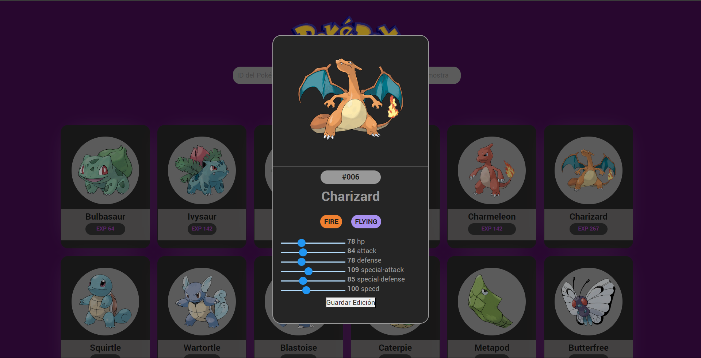

# Pokédex

La **Pokédex** es una aplicación web que te permite explorar una amplia variedad de Pokémon y obtener información detallada sobre ellos. Con esta aplicación, puedes filtrar los Pokémon por tipo y aprender más sobre sus estadísticas y características únicas. 

Configuración

Sigue estos pasos para configurar la Pokédex Pokémon en tu entorno local:

1. Clona el repositorio desde GitHub:
  
      git clone https://github.com/RCNicolas/Pokedex.git
  
2. Navega al directorio del proyecto:
  
      cd pokedex-pokemon
  
3. Abre el archivo `index.html` en tu navegador web.
  

## Uso

### Mostrar Pokémon

1. En la sección "ID del Pokémon a mostrar", ingresa el ID del Pokémon que deseas ver.
2. En la sección "Cantidad de Pokémon a mostrar", ingresa el número de Pokémon que deseas mostrar.
3. Haz clic en el botón "Mostrar Pokémon" para mostrar los Pokémon seleccionados o usa "Todos" para cargar todos los Pokémon disponibles.
4. Ten en cuenta que la cantidad de pokemon se mostrara en base al ID seleccionado, por ejemplo quieres ver solo el ID 100 ingresa el numer 1 en la cantidad de pokemon a mostrar, si quieres ver los siguientes 50 pokemon al ID ingresado tendras que colocar 50 en los pokemones que deseas ver 

### Detalles de Pokémon

* Haz clic en cualquier tarjeta de Pokémon para ver detalles como su imagen, ID, nombre, tipos y puntos de experiencia base.

## Editar Estadísticas

* Dentro de la vista de detalles de un Pokémon, encontrarás una sección llamada "Editar Estadísticas".
* Usa los controles deslizantes para ajustar las estadísticas del Pokémon.
* Las estadísticas disponibles incluyen puntos base de ataque, defensa, velocidad y más.
* Haz clic en el botón "Guardar Edición" para aplicar las modificaciones. Los cambios se guardarán en una base de datos mockAPI.

## API

 **PokéAPI**: Los datos de los Pokémon se obtienen de la [PokéAPI](https://pokeapi.co/), una fuente confiable para información relacionada con Pokémon.

**MockApi**: Los datos editados se envian a la API de [MockApi](https://6509d051f6553137159c10d2.mockapi.io/PokemonAPI)
***

Este proyecto fue creado por [Nicolas Ruiz](https://github.com/RCNicolas). Si tienes alguna pregunta o sugerencia sobre la aplicación, no dudes en ponerte en contacto conmigo.